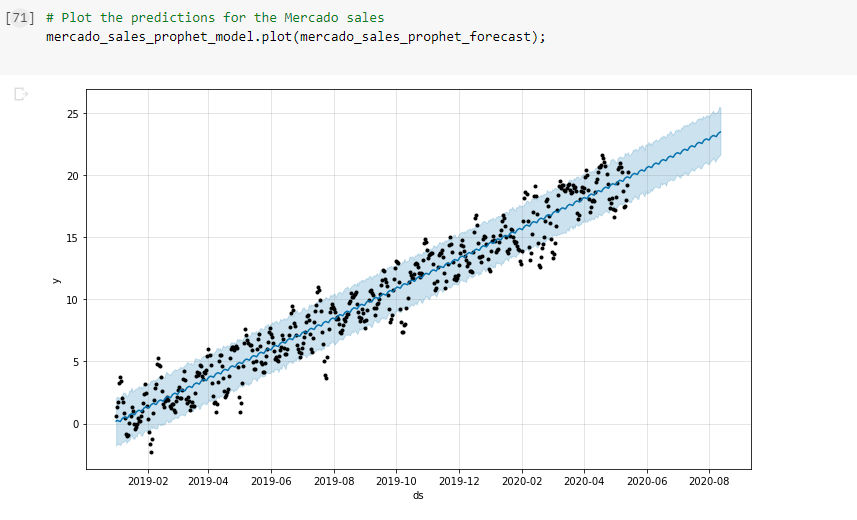

# Challenge11 Forecast Revenue by Using Time Series Models

## Introduction
This project will explore time series forecasting using Pandas, Prophet and Google Colaboratory.

## Data
Here we have Mercado Sales from 2019 through part of May 2020.  This is created using hvplot in Google Colaboratory.

We use that data to project what will happen in the next 90 days.

Our projections leave us with the following prediction:
* Expected 969.6 million
* Worst Case 887.9 million
* Best Case 1,052.1 million